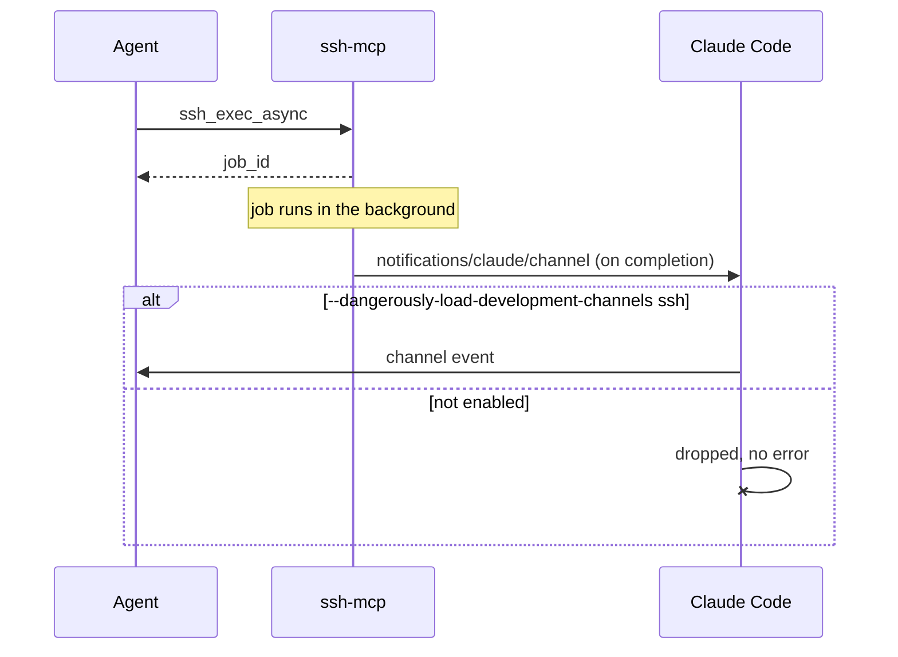

# ssh-mcp

An MCP server that gives agents persistent SSH connections. Connect once for a
reusable id, then execute commands, move files, and run long jobs over a
multiplexed OpenSSH channel instead of paying connection setup on every call.

> **Status:** the tool surface is complete and tested against real sshd on
> Linux and macOS, and against containerised Alpine and Debian remotes. Not yet
> released. See the [design document][design] for the specification and
> `docs/adr/` for the decisions.

## Why not just run `ssh`?

`ControlMaster` in `~/.ssh/config` plus an `ssh` allowlist gives you connection
reuse with no code at all. ssh-mcp exists for the three things that cannot do:

- **Structured results** — `exit_code`, `stdout`, and `stderr` as separate
  fields, not one merged and truncated blob.
- **Durable async jobs** — a long build survives a dropped connection, a server
  restart, and a closed laptop.
- **A host abstraction** — agents address a connection by id instead of
  reconstructing flags on every call.

## Install

```bash
mise use -g github:bojanrajkovic/ssh-mcp   # or: go install github.com/bojanrajkovic/ssh-mcp/cmd/ssh-mcp@latest
```

## Tools

| Tool | Does |
|------|------|
| `ssh_connect` | Open or reuse a connection, returning an id. Idempotent. |
| `ssh_exec` | Run a command; returns exit code, stdout and stderr separately. |
| `ssh_exec_async` | Start a command that survives the connection dropping. |
| `ssh_job_status` / `ssh_job_wait` | Peek at a job, or block until it finishes. |
| `ssh_list` / `ssh_disconnect` | List connections; close one's control master. |
| `ssh_copy` | Copy a file or directory, either direction. |
| `ssh_read_file` / `ssh_write_file` | Read or replace a remote file's contents. |

Each output stream has an inline budget, 10 kB by default. Output over the
budget, or output that is not text, *spills*: it comes back as a path to a
local file holding all of it, instead of inline. Nothing is truncated.

Connection options are a fixed set: `user`, `port`, `identity_file`,
`identity_agent`, `forward_agent`, `jump_host`, `connect_timeout_seconds`, and
`set_env`. Anything else is refused. `ProxyCommand`, `LocalCommand`,
`KnownHostsCommand` and `Match exec` all run commands on *your* machine, so
they are not expressible; `jump_host` covers bastions.

## Configuration

Environment variables only, which is what an MCP client's config file already
carries:

| Variable | Default |
|----------|---------|
| `SSH_MCP_CONFIG_DIR` | `~/.config/ssh-mcp` |
| `SSH_MCP_SPILL_DIR` | `~/.cache/ssh-mcp/spill` |
| `SSH_MCP_SPILL_BYTES` | `10240` |
| `SSH_MCP_SSH_CONFIG` | `~/.ssh/config` |

The server writes its own `ssh_config` and includes yours; yours is never
modified. First-use host keys are recorded in the server's own `known_hosts`,
so an agent's trust decisions never land in your trust store.

Register it with your MCP client:

```jsonc
{
  "mcpServers": {
    "ssh": {
      "command": "ssh-mcp",
      "env": { "SSH_MCP_SPILL_BYTES": "10240" }
    }
  }
}
```

Linux and macOS. Windows is not supported: `ControlMaster` sockets do not exist
there.

## Enabling channel notifications

`ssh_exec_async` can push a completion event to the client instead of making
the agent poll. Delivery is best effort: the client drops the event silently
unless the session opts in, so `ssh_job_wait` and `ssh_job_status` stay
authoritative regardless.

No server-side configuration is needed — register `ssh` as in
[Configuration](#configuration), then launch Claude Code with the server name
in `--dangerously-load-development-channels`:

```bash
claude --dangerously-load-development-channels ssh
```

Don't also pass `--channels ssh` for the same server. Claude Code keeps one
channel entry per server name and matches on the first one found; a plain
`--channels` entry shadows the dev entry added by
`--dangerously-load-development-channels`, and notifications stay silently
dropped with no indication why.



## Development

Everything runs through [mise][mise]. There is no Makefile — one task runner is
enough.

```bash
mise install          # toolchain: Go, golangci-lint, gofumpt, lefthook, govulncheck
mise run ci           # what CI runs: fmt-check, vet, lint, test, build
```

Individual tasks:

| Task | Does |
|------|------|
| `mise run fmt` | Format with gofumpt |
| `mise run fmt-check` | Fail if anything needs formatting |
| `mise run vet` | `go vet ./...` |
| `mise run lint` | golangci-lint |
| `mise run test` | Unit tests with race detector, prints total coverage |
| `mise run test-integration` | Tests against a real sshd (needs `sshd` installed) |
| `mise run vuln` | govulncheck over dependencies and stdlib |
| `mise run build` | Build `./ssh-mcp` with version stamped |
| `mise run dist` | Cross-compile linux and darwin binaries into `dist/` |

Install the git hooks with `lefthook install`. They run gofumpt on staged files
and check commit message format; full lint and tests are CI's job.

[design]: https://outline.gaur-kardashev.ts.net/doc/ssh-mcp-persistent-ssh-connections-for-agents-design-ifTebcw28w
[mise]: https://mise.jdx.dev
