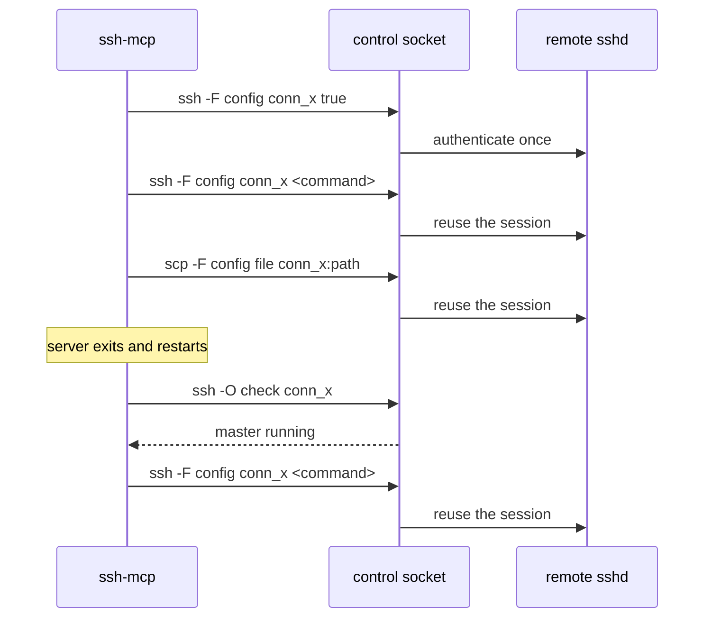

# 1. OpenSSH ControlMaster is the substrate

Date: 2026-08-20

## Status

Accepted

## Context

The server must hold SSH connections open across many tool calls, run commands,
copy files, and start jobs that outlive a single call. Two substrates can do
this.

`golang.org/x/crypto/ssh` is a wire-protocol library. It speaks the SSH
protocol and nothing above it: no `ssh_config` parsing, so no `Host` matching,
no `Include`, no `ProxyJump`, no `IdentityFile` resolution. Agent forwarding,
`known_hosts` handling, and jump-host chains are all caller-supplied. In
exchange it gives exact control, structured errors, and a clean separation
between a transport failure and a remote command's exit status.

OpenSSH multiplexing solves the same problem at a different layer.
`ControlMaster` establishes one authenticated connection and exposes it as a
Unix socket; subsequent `ssh` and `scp` invocations reuse it without
re-authenticating. Configuration comes from `ssh_config`, which the server can
write and OpenSSH parses.

## Decision

Shell out to OpenSSH with `ControlMaster`.

## Consequences

Configuration behaviour matches the user's own `ssh` exactly, because it is the
same binary reading the same files. `ProxyJump`, agent forwarding, MFA,
`known_hosts`, and every future OpenSSH feature work without server support.

Connection state lives on the filesystem, not in server memory. The control
socket outlives the server process, so a restart mid-task loses nothing, and
`ssh -O check` and `ssh -O exit` provide liveness and teardown without a
session registry.

`scp` uses the same socket, so file transfer needs no second connection and no
second authentication.

The cost is an ambiguous exit code. `ssh` exits 255 for its own transport
failures, and a remote command can also exit 255. The server tells the two
apart by running `ssh -O check` against the socket: a live master means the
remote command returned 255, a dead one means the transport failed.

Output arrives as bytes from a subprocess rather than as a structured result,
so stdout and stderr separation depends on how the subprocess is wired rather
than on protocol-level channels.

Windows is out of scope, since it has no `ControlMaster` sockets.
