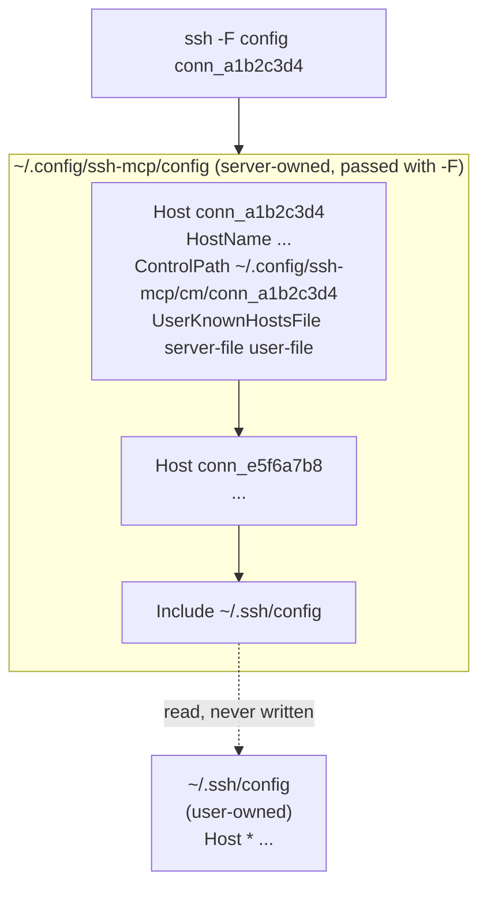

# 3. The server owns its ssh_config and never writes the user's

Date: 2026-08-20

## Status

Accepted

## Context

Connection settings have to reach `ssh`, and `ssh_config` is the only file it
reads. The server could write the user's `~/.ssh/config`, or own a file of its
own.

Writing the user's file means an agent-driven process edits a security-critical
file that the user also edits by hand, on every connection. It also fills their
shell completion with generated host names, and anything else reading that file
sees them.

Owning a separate file raises the opposite problem: hosts the user has already
defined, with their keys and jump hosts, would be invisible to the server.

## Decision

The server owns `~/.config/ssh-mcp/config` and passes it with `-F` on every
invocation. Generated stanzas come first and the file ends with an `Include` of
the user's config.

Control sockets live in `~/.config/ssh-mcp/cm/` and first-use host keys in
`~/.config/ssh-mcp/known_hosts`, with `UserKnownHostsFile` listing the server's
file before the user's.

## Consequences

The user's `~/.ssh/config` is never written, and nothing the server creates
lands in their `~/.ssh` at all.

Ordering matters. `ssh_config` uses the first value obtained for each keyword,
so generated stanzas must precede the `Include`. Otherwise a user's `Host *`
block would override settings the server depends on. The whole file is
re-rendered whenever a stanza is added, so the `Include` cannot drift from the
end.

Reading order is top to bottom. The first stanza that matches `conn_a1b2c3d4`
sets each keyword, and the user's `Host *` block only fills keywords the stanza
left unset.

Every host the user has defined stays reachable, since their config is included
rather than replaced.

Host keys accepted on first use are written to the server's `known_hosts`,
because `ssh` records new keys in the first file listed. The user's trust store
is read but left byte-identical, so a host an agent decided to trust does not
silently become trusted at their own shell.

Control sockets sit under the server's directory rather than `~/.ssh/cm/`,
which keeps ownership in one place. The path also stays short: Unix domain
socket paths are capped near 104 bytes on macOS, and `ssh` appends a suffix
while establishing a master.

Anything the user configures for themselves is invisible to their own `ssh`
command when it was created through the server. Making a host available at
their shell is a deliberate act, not a side effect.
