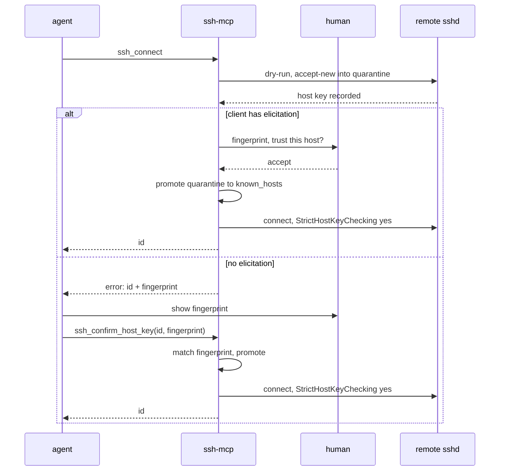

# 7. Host keys are confirmed before trust

Date: 2026-08-28

## Status

Accepted

## Context

Stanzas used to set `StrictHostKeyChecking accept-new`: first contact with a
host trusted whatever key it presented and recorded it silently. Interactive
`ssh` shows the fingerprint and waits for a "yes" at the same moment. An agent
calling `ssh_connect` had that trust decision made for it, invisibly, on every
new host.

MCP gives a server one way to reach the human: an elicitation the client
renders as a dialog. Claude Code, VS Code, and Cursor declare the capability;
other clients may not, so the design cannot depend on it.

## Decision

Stanzas render `StrictHostKeyChecking yes`. A key no known_hosts line trusts
fails the connect instead of being accepted. Existing stanzas are rewritten to
`yes` on startup, so configs written before this decision stop accepting
silently too.

The key is captured, not scanned. `ssh_connect` first dry-runs ssh with
`accept-new` pointed at a quarantine known_hosts under the server's directory.
ssh itself negotiates and records the exact key it would use. `ssh-keyscan`
was rejected because it cannot reach through `ProxyJump` and resolves
connection parameters a second time, separately from ssh.

That dry run disables every authentication method. Key exchange records the
host key before authentication happens, so with nothing left to authenticate
with, the run can never open a connection to a host the human has not yet
confirmed — an agent socket or a `SetEnv` value is never exposed to a host
that may be about to be refused. The run failing is expected: a capture
succeeds when the quarantine holds a key afterward, not when ssh exits zero.

Fingerprints are computed in-process from the recorded known_hosts line: SHA256
of the decoded key blob, base64-encoded without padding and prefixed
`SHA256:`, which matches what `ssh-keygen -lf` reports. ssh-keygen is not
needed at runtime.

Confirmation asks the human, one prompt per unconfirmed key. When the client
declares elicitation, `ssh_connect` elicits with the fingerprint. Since
protocol 2026-07-28, a tool call cannot send elicitation/create mid-call.
Instead the call returns an input request, the client answers it, and the
call is retried with the answer attached — the protocol's multi-round-trip
pattern ([SEP-2322](https://modelcontextprotocol.io/specification/draft/client/elicitation)).
The SDK bridges older clients itself, so one path serves both. Accept
promotes the quarantined line into the server's known_hosts and the connect
proceeds; promotion re-verifies the fingerprint against that line under the
store's lock, so the key a human confirmed is provably the key that gets
trusted. Decline discards the quarantine and the connect fails. Nothing
records a refusal: known_hosts stays the only trust state, and the next
connect asks again.

Clients without elicitation get an error carrying the connection id and the
fingerprint. `ssh_confirm_host_key(id, fingerprint)` requires the exact
fingerprint echoed back, then promotes and connects. This cannot prove a human
was consulted — nothing in MCP can. It forces the fingerprint into the
conversation and makes trust an explicit, auditable call instead of a silent
side effect.

`SSH_MCP_ACCEPT_NEW=1` restores the old behavior by auto-promoting the
captured key, with the fingerprint logged. The variable changes behavior, not
config: stanzas always render `yes`, so toggling it rewrites nothing.

Scope is the target host's key only. A `ProxyJump` bastion resolves through
the user's own config, so its key is governed by the user's known_hosts and
policy, exactly as before this decision.

## Consequences

First contact with a new host costs one round-trip to a human, or one explicit
tool call. Changed keys were refused before and still are.

Both paths converge on promotion, and the connection then verifies against
exactly the promoted line. The key the human saw is the key that gets trusted;
there is no window for a different key to slip in between.

A quarantined key that is never confirmed is inert. It trusts nothing, and the
next capture for the same connection overwrites it.
